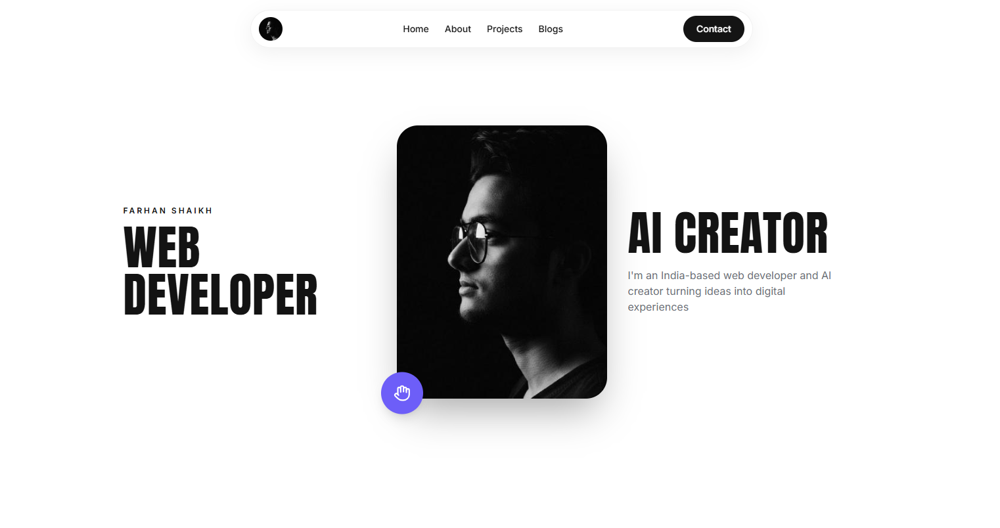

# Farhan Shaikh — Portfolio

A modern personal portfolio website showcasing my work as a **Web Developer & AI Creator**. The portfolio features custom web development, Shopify stores, CMS websites, AI-powered video creation, and creative digital projects.



🌐 **Live Website:** [shaikhmohammadfarhan.vercel.app](https://shaikhmohammadfarhan.vercel.app/)

## Getting Started

```bash
npm install
npm run dev
```

Open [http://localhost:5173](http://localhost:5173) in your browser.

## Build for Production

```bash
npm run build
npm run preview
```

## Deploy to Vercel

### Option 1 — Vercel CLI

```bash
npm install -g vercel
vercel
```

### Option 2 — GitHub + Vercel Dashboard

1. Push this project to a GitHub repository.
2. Go to [Vercel](https://vercel.com/new).
3. Import your repository.
4. Select **Vite** as the framework preset.
5. Click **Deploy**.

## What's Inside

- Modern pill-style navigation
- Responsive hero section
- Animated image and interaction elements
- Web development services section
- Project showcase with category-based filtering
- Animated statistics and About section
- Testimonials section
- FAQ accordion
- Blog preview section
- Contact form
- Smooth page transitions and micro-interactions
- Responsive design for desktop, tablet, and mobile
- `/about`, `/projects`, and `/blogs` routes

## Services

- CMS Website Development
- Shopify Store Development
- Custom Site Development
- AI Video Creation

## Tech Stack

- React
- Vite
- Tailwind CSS
- Framer Motion
- Lucide React
- React Router
- Vercel

## Repository Topics

`react` `vite` `tailwindcss` `framer-motion` `react-router` `portfolio-website` `web-development` `web-developer` `ai-creator` `ai-video` `shopify` `cms-development` `vercel`

## License

This project is for portfolio and personal showcase purposes.
